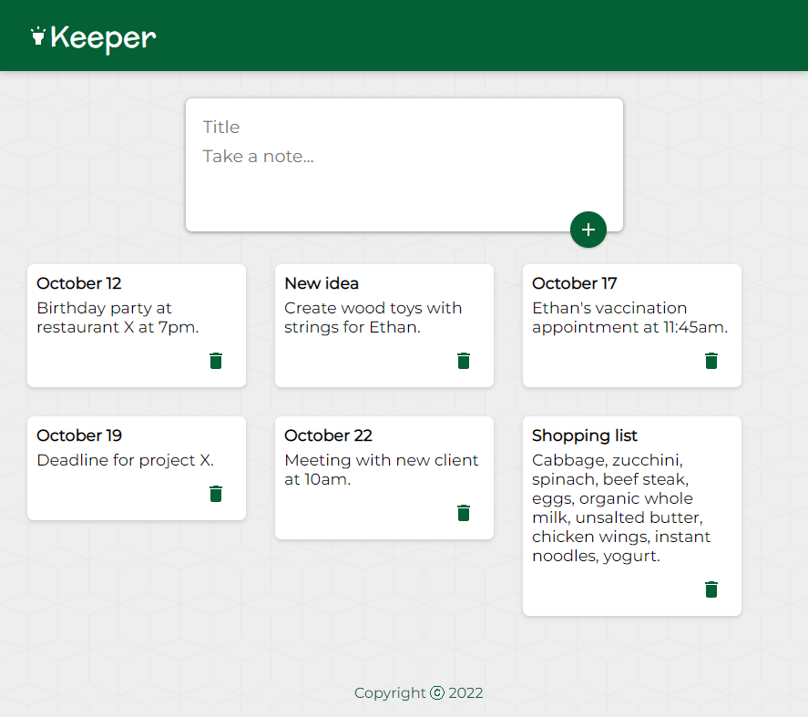

# keeper

A note keeper application (Google Keep clone)  
  
Live Version: **https://keeper12.netlify.app/**

This app is built using:

- react, material-UI (frontend)
- node, express (backend)
- mongoDB, mongoose (database)
- axios, react query (server-side state management)

